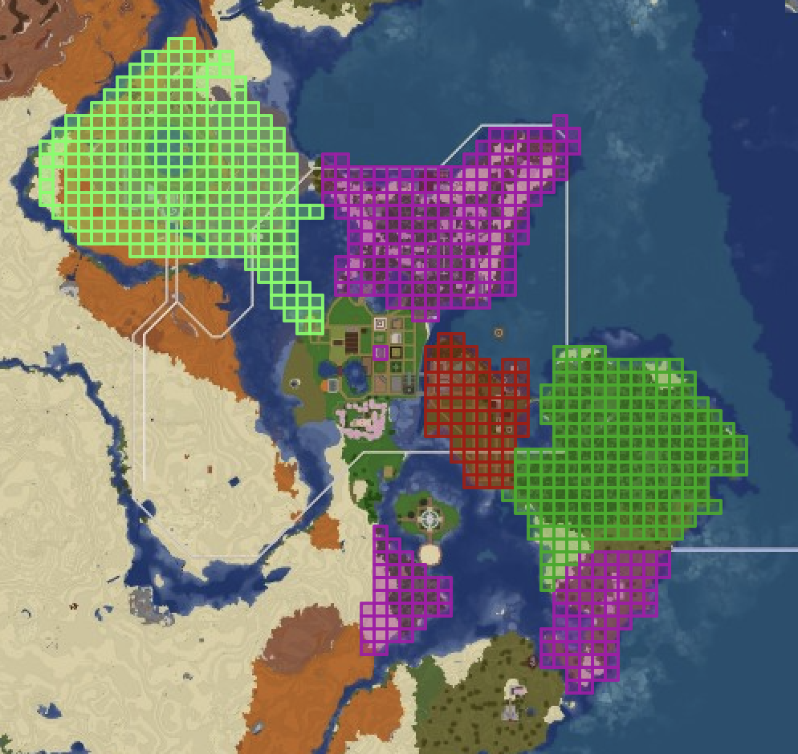

## VisualClaims

VisualClaims is a Paper/Spigot plugin that lets players found towns, invite friends, visually claim chunks (no block protection), and see their borders rendered live on Dynmap. It combines lightweight gameplay commands with persistent storage and colourful map overlays so servers can offer simple land visualization without heavy setup.

### Highlights
- Found a town, invite/join friends, view members, and manage alliances or wars between towns.
- Claim/unclaim chunks manually or enable autoclaim and autohistory while exploring.
- Sync every claim to Dynmap with custom colours, configurable line weight, and fill opacity.
- Public town listings show descriptions, members, alliances, wars, and claim counts.
- Chunk history keeps a log of who claimed a spot and what alliances/wars were active at the time.
- Server-wide war mode shows a live scoreboard of wars/alliances, with per-player scoreboard toggles.
- Town leaderboard highlights leaders by claims and kills, viewable in chat or via a sidebar toggle.
- Territory entry notifications alert town members/owners when someone enters their land.
- Store towns as JSON on disk for safe restarts and easy editing.
- Simple permission scheme with an admin bypass for moderators and test servers.
- (Experimental) Playtime-based claim caps with `/claimlimit` visibility and admin bonuses.

### Requirements
- Java 17 or newer.
- Paper or Spigot server 1.20+ (API version 1.20, tested against Paper 1.21.8).
- Dynmap installed and enabled (the plugin declares a hard dependency and will not start without it).

## Getting Started
1. Download the latest VisualClaims build (or compile it yourself, see below).
2. Ensure Dynmap is present on the server and has completed its initial setup.
3. Drop `VisualClaims.jar` into your server's `plugins/` folder.
4. Start the server. VisualClaims will create a `config.yml` and a `towns/` directory under `plugins/VisualClaims/`.
5. Grant players the permissions they need (defaults allow self-service town management).

### Building From Source
The project uses Maven.

```bash
mvn package
```

Dynmap's API is provided via `libs/Dynmap-3.7-beta-10-spigot.jar`, referenced with `scope=system` in `pom.xml`. Make sure the jar exists at `libs/Dynmap-3.7-beta-10-spigot.jar` relative to the project root, or update the `systemPath` to match your environment before building.

The packaged jar ends up in `target/visualclaims-1.0.0.jar`.

## Configuration
The config file lives at `plugins/VisualClaims/config.yml` after first launch:

```yaml
# maximum chunks a player's town can claim
max-claims-per-player: 64

# award chunks based on playtime (Statistic.PLAY_ONE_MINUTE); existing claims are never revoked
use-playtime-scaling: false
chunks-per-hour: 2

# default town color (vanilla color names)
default-color: GREEN

# Dynmap marker style
fill-opacity: 0.35
line-opacity: 0.9
line-weight: 2
```

- `max-claims-per-player`: Hard cap on chunks per town; admins with `visclaims.admin` bypass it.
- `use-playtime-scaling`: When true, the claim cap scales with playtime (2 chunks/hour by default). The cap will never force-unclaim existing land.
- `chunks-per-hour`: Chunk allowance per played hour when playtime scaling is enabled.
- `default-color`: Applied to newly created towns; value must match a vanilla chat colour name.
- Marker style keys tweak the appearance of the Dynmap polygons.
- Restart the server (or reload VisualClaims) after editing the config to apply changes.

## Commands & Permissions
| Command | Description | Permission | Default |
| --- | --- | --- | --- |
| `/createtown <name>` | Create your town in the current world. | `visclaims.createtown` | true |
| `/deletetown` | Delete your town and free all chunks. | `visclaims.deletetown` | true |
| `/claimchunk` | Claim the chunk you are standing in. | `visclaims.claim` | true |
| `/unclaim` | Unclaim the current chunk (admins can force-unclaim). | `visclaims.unclaim` | true |
| `/autoclaim` | Toggle automatic claiming while you walk. | `visclaims.autoclaim` | true |
| `/autounclaim` | Toggle automatic unclaiming of owned chunks as you walk. | `visclaims.autounclaim` | true |
| `/autohistory` | Toggle automatic chunk history popups while you walk. | `visclaims.autohistory` | true |
| `/leaderboard [toggle]` | Show top towns by claims/kills in chat or toggle the sidebar leaderboard. | `visclaims.leaderboard` | true |
| `/claimalerts` | Toggle the chat messages when you enter or leave claimed chunks. | `visclaims.claimalerts` | true |
| `/silentvisit` | Toggle silently entering other players' towns (no alerts sent to them). | `visclaims.silentvisit` | op |
| `/claimreload` | Admin: reload VisualClaims config and data. | `visclaims.admin` | op |
| `/settownname <name>` | Rename your town. | `visclaims.setname` | true |
| `/settowncolor <color>` | Change the town colour (see list below). | `visclaims.setcolor` | true |
| `/settowndesc <text>` | Set your town description. | `visclaims.setdesc` | true |
| `/claiminfo` | Display your town's stats, members, allies, wars. | `visclaims.claiminfo` | true |
| `/claimlimit [player]` | Show the current claim limit, playtime hours, and bonuses. Admins can target others. | `visclaims.claimlimit` | true |
| `/claimhistory` | Show recent claim history for the current chunk. | `visclaims.history` | true |
| `/towninvite <player>` | Invite a player to your town. | `visclaims.invite` | true |
| `/jointown <town>` | Accept a town invitation. | `visclaims.join` | true |
| `/townmembers` | List members in your town (owner only). | `visclaims.members` | true |
| `/removemember <player>` | Remove a member from your town (owner only). | `visclaims.kick` | true |
| `/towns` | Public list of all towns, descriptions, and members. | `visclaims.towns` | true |
| `/towninfo <town>` | Public details for a specific town. | `visclaims.towninfo` | true |
| `/war <town>` | Declare/resolve war with another town (owner only). | `visclaims.war` | true |
| `/alliance <town>|accept <town>|remove <town>` | Manage alliances (owner only). | `visclaims.alliance` | true |
| `/claim` | Show the quick reference help. | `visclaims.help` | true |
| `/claim admin` | Show admin-only claim commands. | `visclaims.adminhelp` | op |
| `/warscoreboard` | Toggle your war/alliance sidebar scoreboard. | `visclaims.warscoreboard` | true |
| `/warmode <on|off>` | Admin: enable/disable global war mode & scoreboards. | `visclaims.warmode` | op |
| `/claimadmin` | Admin-only help list. | `visclaims.adminhelp` | op |
| `/adjustclaims <player> <add|remove> <amount>` | Admin: add or subtract bonus claim slots for a player. | `visclaims.admin` | op |

`visclaims.admin` grants moderators the ability to bypass claim limits and force-unclaim land owned by other towns.

Playtime scaling reads the built-in `Statistic.PLAY_ONE_MINUTE` (same counter used by EssentialsX `/playtime`) and grants `chunks-per-hour` claims per played hour. Existing claims are never revoked if the cap drops; the player simply cannot claim more until their allowance grows.

### Notes
- `/towns` lists only town names with a clickable `[Info]` button to open details, using each town's configured colour.
- War/alliance commands are only available while admins have enabled `/warmode`. Enabling war mode turns on the scoreboard for everyone by default; players can use `/warscoreboard` to toggle their own view.
- Chunk history is bootstrapped on load so existing claims have a baseline entry.

### Supported Colours
`VanillaColor` covers the standard Minecraft chat colour names: `BLACK`, `DARK_BLUE`, `DARK_GREEN`, `DARK_AQUA`, `DARK_RED`, `DARK_PURPLE`, `GOLD`, `GRAY`, `DARK_GRAY`, `BLUE`, `GREEN`, `AQUA`, `RED`, `LIGHT_PURPLE`, `YELLOW`, `WHITE`.

## Data & Persistence
- Each town is stored in `plugins/VisualClaims/towns/<owner-uuid>.json` using Gson.
- Data is saved whenever towns or claims change and again on shutdown.
- On startup the plugin reloads all town files, reconstructs chunk ownership, and refreshes Dynmap markers.

## Dynmap Integration
- The plugin registers a dedicated marker set `visualclaims.towns`.
- Every claimed chunk becomes an `AreaMarker` styled with the town colour and your configured opacity/line settings.
- Claims update immediately after players claim/unclaim chunks, rename towns, or adjust colours.
- Admin force-unclaims and town deletions purge the relevant markers.

## Gameplay Tips
- Autoclaim only works if you already own a town and are inside unclaimed territory. You will receive feedback if you hit the chunk cap or collide with another town's claim.
- Movement messages fire whenever you cross chunk boundaries—whether you walk or teleport—so players always know when they enter or leave a town.
- Use `/claimalerts` to mute your personal enter/leave messages. Staff (or anyone with `visclaims.silentvisit`) can toggle `/silentvisit` to avoid alerting other towns when passing through their land.
- `/leaderboard` (alias `/lb`) shows the top 3 towns by kills, then claims, plus your own kills/deaths/claims. Add `toggle` to enable a persistent sidebar.
- Outposts (non-contiguous claim clusters) are capped at roughly 1% of your theoretical claim limit with an exponential reduction as your cap grows. Your first claim is exempt, expansions of existing clusters are fine, and admins (`visclaims.admin`) bypass the cap. Existing outposts stay; the cap applies to creating new isolated clusters.
- If you exceed your outpost cap, no new claims are allowed (including expansions) until you unclaim enough chunks to get back to or under your cap. `/claimlimit` shows your current/allowed outposts. `/autounclaim` can help shed land quickly.

## Gallery

| In-Game Chat Notifications | Dynmap Overlay |
| --- | --- |
|  |  |

## Contributing
Issues and pull requests are welcome. If you submit features, include testing notes (commands run, server version) and ensure new configuration keys have sensible defaults.
